# 자작 PCB 모음

[ESP-Prog용 Adaptor](esp-prog-adaptor/) 
([README.md](esp-prog-adaptor/README.md))

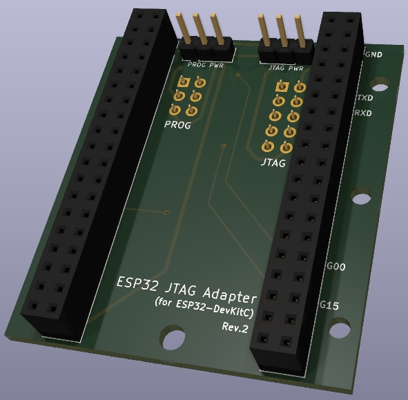

---

[Raspberry Pi용 IO 확장](pi-extend/)
([README.md](pi-extend/README.md))

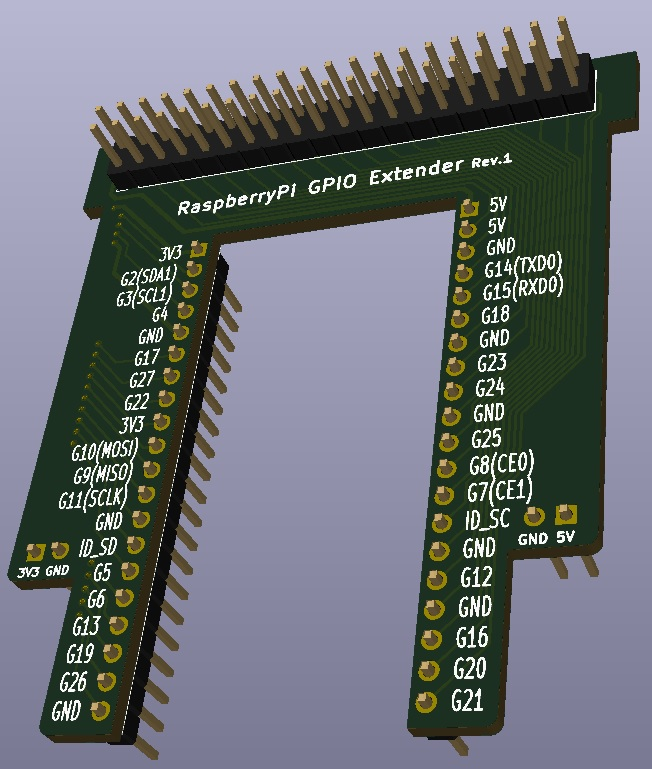

---

[Odroid N2(+)용 IO 확장](odroid-extend/)
([README.md](odroid-extend/README.md))

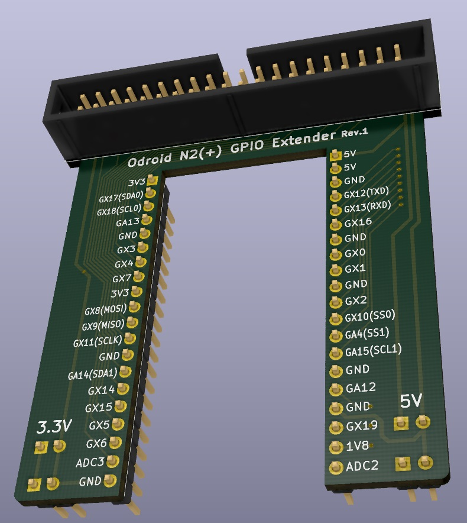

---

[74HC165를 사용한 입력 보드 (DIP Ver.)](input-74hc165/)
([README.md](input-74hc165/README.md))

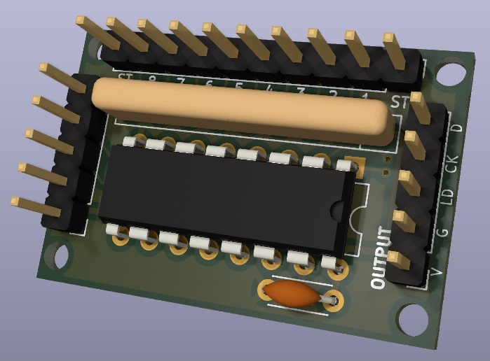

---

[74HC165를 사용한 Arcade Joystick 입력 보드 (DIP Ver.)](joystick-input/)
([README.md](joystick-input/README.md))

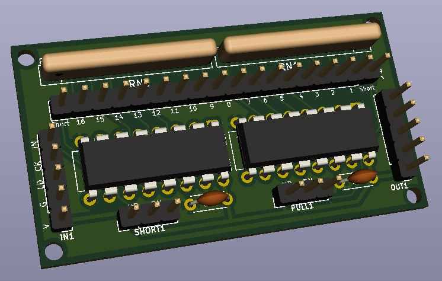

---

[74HC165를 사용한 Arcade Joystick 입력 보드 (DIP 2P Ver.)](joystick-input_2p/)
([README.md](joystick-input_2p/README.md))

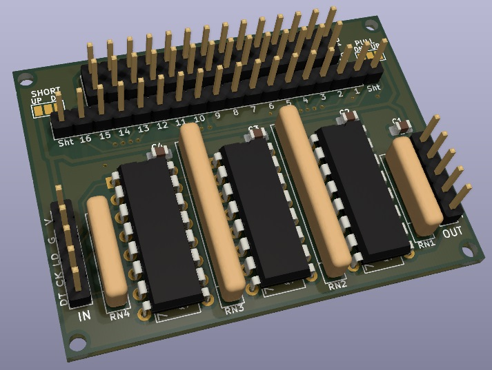

---

[74HC165를 사용한 Arcade Joystick 입력 보드 (SMD Ver.)](joystick-input_smd/)
([README.md](joystick-input_smd/README.md))

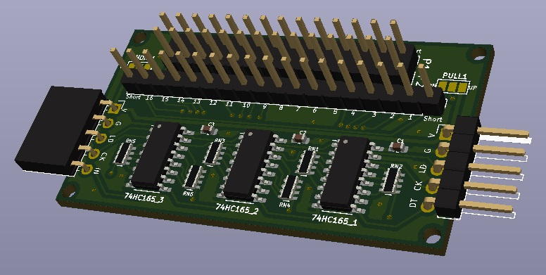

---

[74HC165를 사용한 Arcade Joystick 입력 보드 (JST 커넥터 타입)](joystick-input_jst/)
([README.md](joystick-input_jst/README.md))

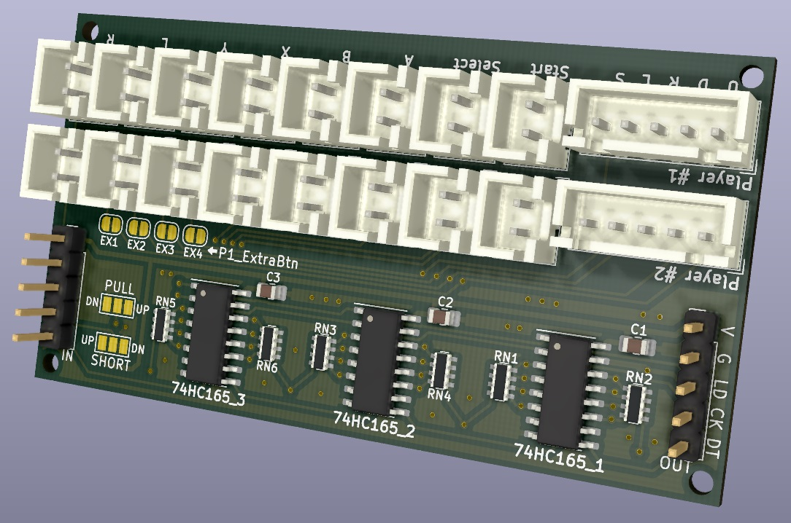

---

[모니터 OSD 컨트롤 버튼 보드](monitor_control_board/)
([README.md](monitor_control_board/README.md))

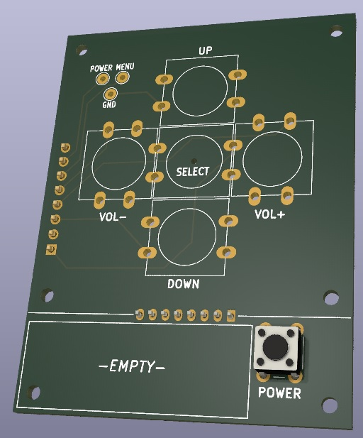

---

[Raspberry Pie 전원 모듈](rasp_power_module/)
([README.md](rasp_power_module/README.md))

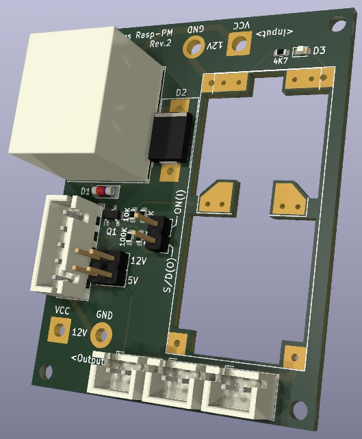

---

[Raspberry Pie GPIO 입력 모듈](rasp_gpio_input/)
([README.md](rasp_gpio_input/README.md))

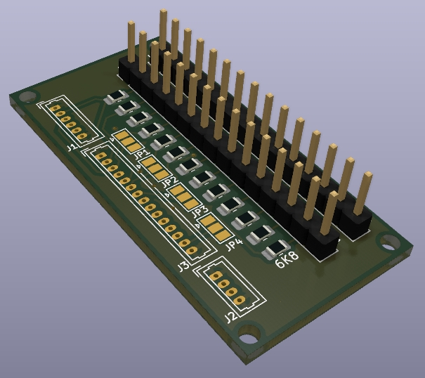

---
