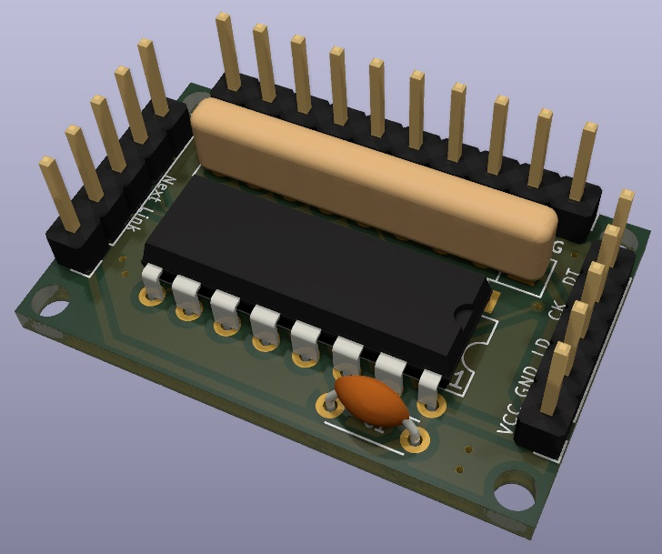

# 자작 PCB 모음

[ESP-Prog용 Adaptor](esp-prog-adaptor/) 
([README.md](esp-prog-adaptor/README.md))

---

[Raspberry Pi용 IO 확장](https://github.com/amos42/pcb_gpio_extend/tree/master/rasp_gpio_extend/)

---

[Odroid N2(+)용 IO 확장](https://github.com/amos42/pcb_gpio_extend/tree/master/odroid_gpio_extend/)

---

[74HC165를 사용한 입력 보드 (DIP Ver.)](input-74hc165/)
([README.md](input-74hc165/README.md))

---

[74HC165를 사용한 Arcade Joystick 입력 보드 (DIP 1P Ver.)](https://github.com/amos42/pcb_joystick_input/tree/master/joystick_74hc165_input_1p/)

---

[74HC165를 사용한 Arcade Joystick 입력 보드 (DIP 2P Ver.)](https://github.com/amos42/pcb_joystick_input/tree/master/joystick_74hc165_input/)

---

[74HC165를 사용한 Arcade Joystick 입력 보드 (SMD Ver.)](https://github.com/amos42/pcb_joystick_input/tree/master/joystick_74hc165_input_smd/)

---

[74HC165를 사용한 Arcade Joystick 입력 보드 (JST 커넥터 타입)](https://github.com/amos42/pcb_joystick_input/tree/master/joystick_74hc165_input_jst/)

---

[Raspberry Pie GPIO Arcade Joystick 입력 보드](https://github.com/amos42/pcb_joystick_input/tree/master/joystick_gpio_input/)

---

[모니터 OSD 컨트롤 버튼 보드](https://github.com/amos42/pcb_monitor_osd_control/)

---

[Raspberry Pie 전원 모듈](https://github.com/amos42/pcb_rasp_power_module/)

---
