# ESP-Prog to ESP32-DevKitC Adaptor

Test Sample

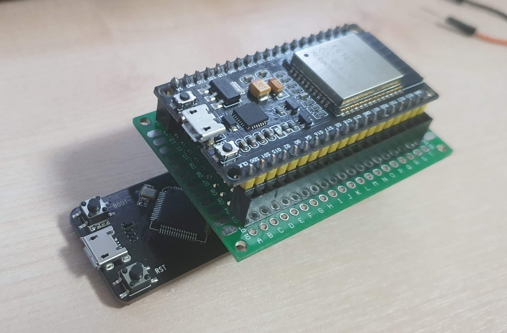

[JTAG 보드 자료 링크](https://docs.espressif.com/projects/espressif-esp-iot-solution/en/latest/hw-reference/ESP-Prog_guide.html)

[개발 보드 링크](https://www.espressif.com/en/products/devkits)

개발 보드 관련 이미지들

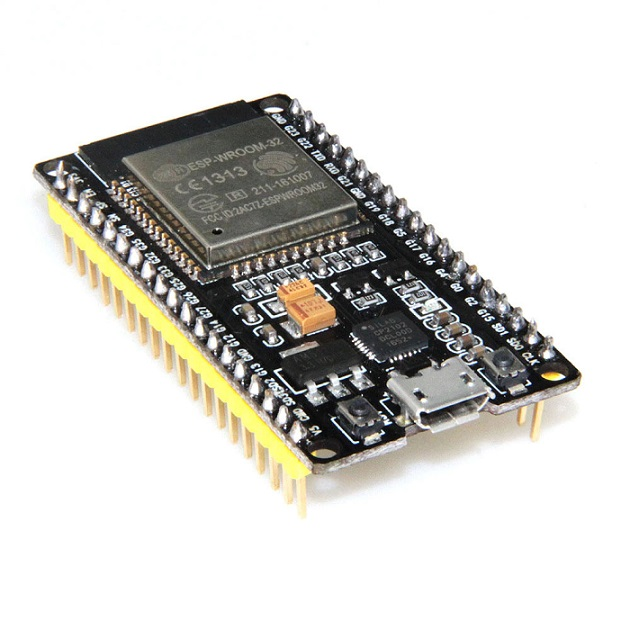

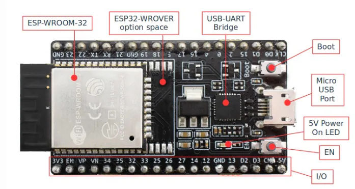

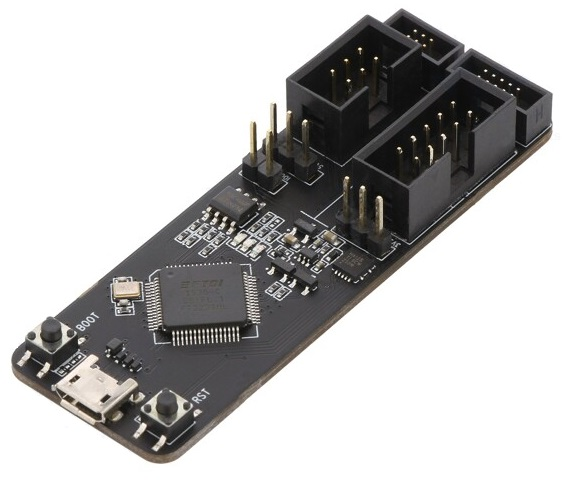

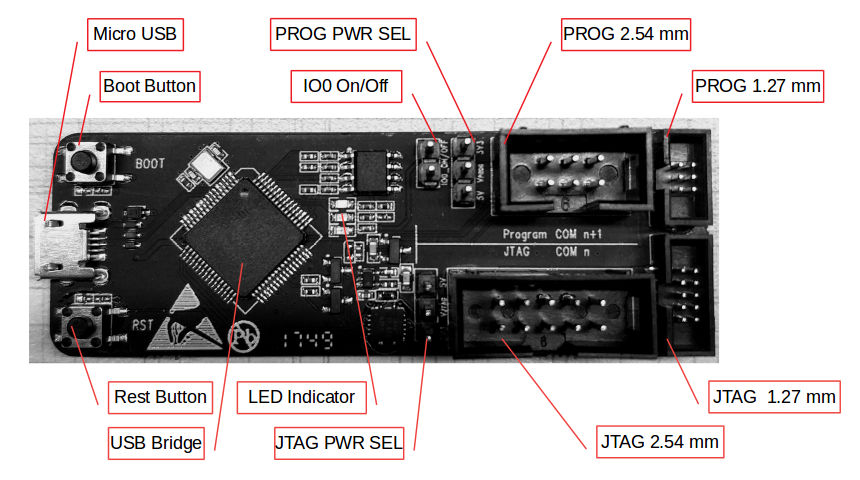

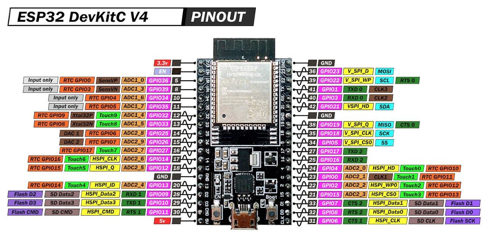

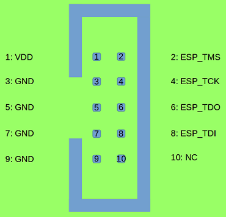
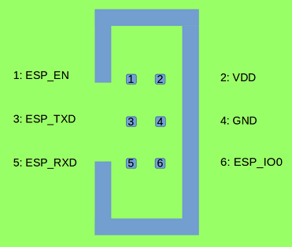

회로도

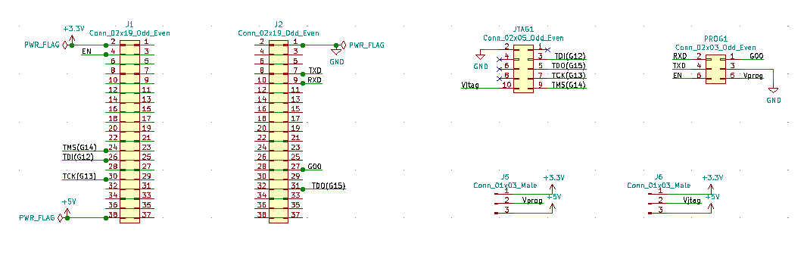

PCB

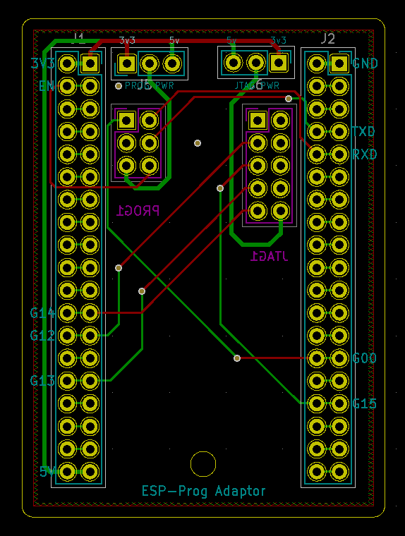

샘플 이미지 앞면

샘플 이미지 뒷면

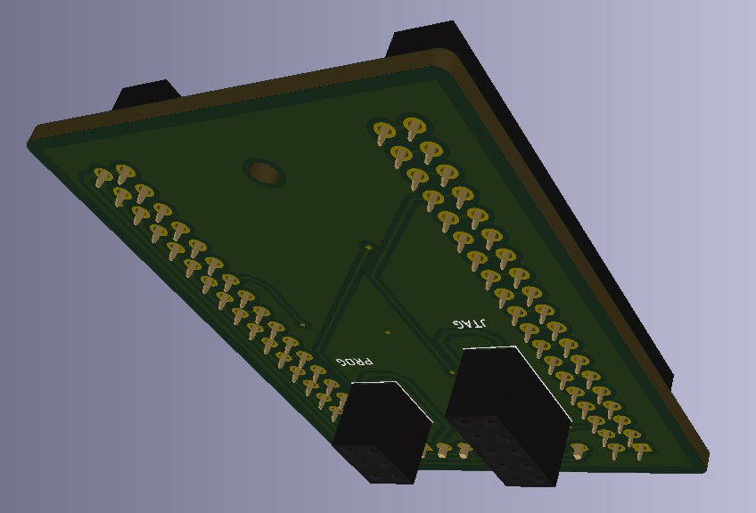

