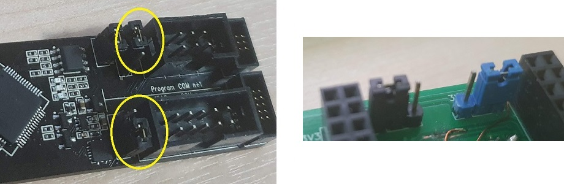

# ESP-Prog to ESP32-DevKitC Adaptor

Test Sample

[JTAG 보드 자료 링크](https://docs.espressif.com/projects/espressif-esp-iot-solution/en/latest/hw-reference/ESP-Prog_guide.html)

[개발 보드 링크](https://www.espressif.com/en/products/devkits)

개발 보드 관련 이미지들

회로도

PCB 배선

PCB 이미지 앞면

샘플 이미지 앞면

샘플 이미지 뒷면

전원 설정

ESP-Prog의 전원 세팅에 맞춰 adaptor의 전원도 3.3V와 5V로 설정해 주어야 한다.

실제 적용 모습

