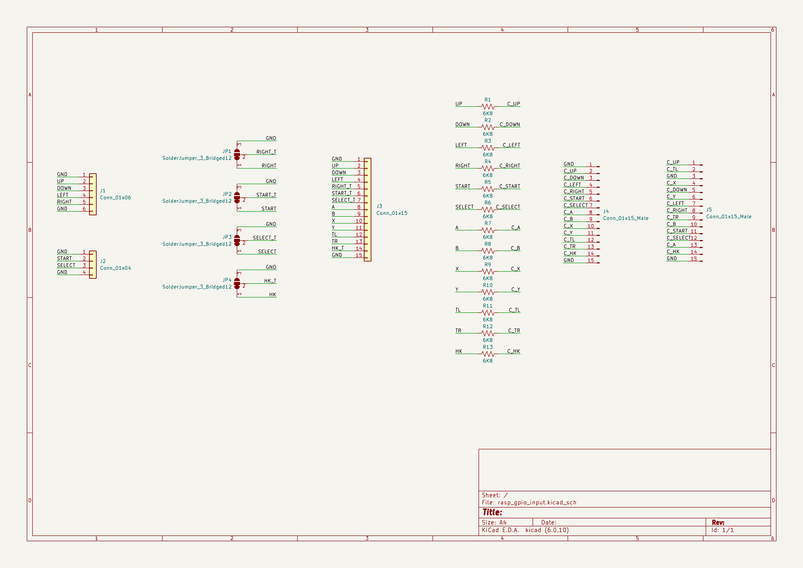
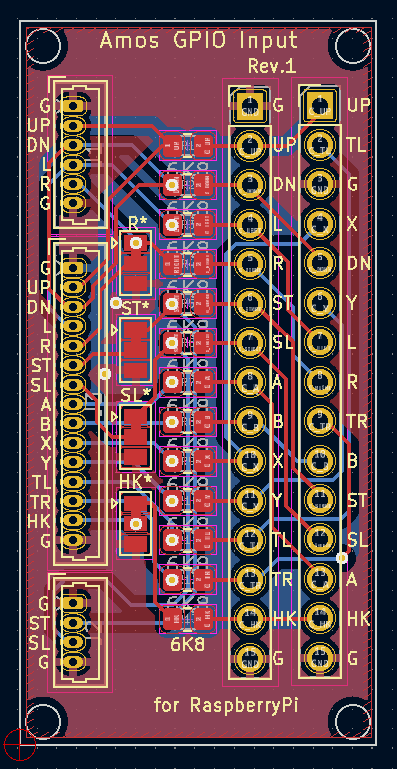
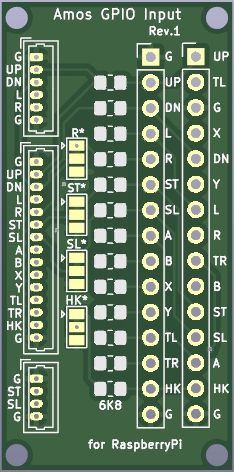
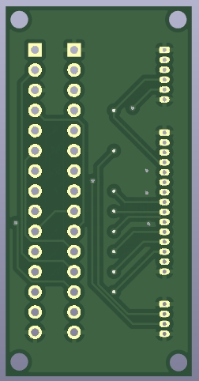

# Raspberry Pie GPIO 입력 모듈

GPIO 보호 기능을 갖는 입력 모듈

---

## 회로도

## PCB

## BOM

| Designator | Package | Quantity | Designation |
|------------|---------|----------|-------------|
| R1~R13 | R_0805_2012Metric | 1 | 6.8K

## PCB 이미지

### 앞면

### 뒷면

## 샘플 이미지

