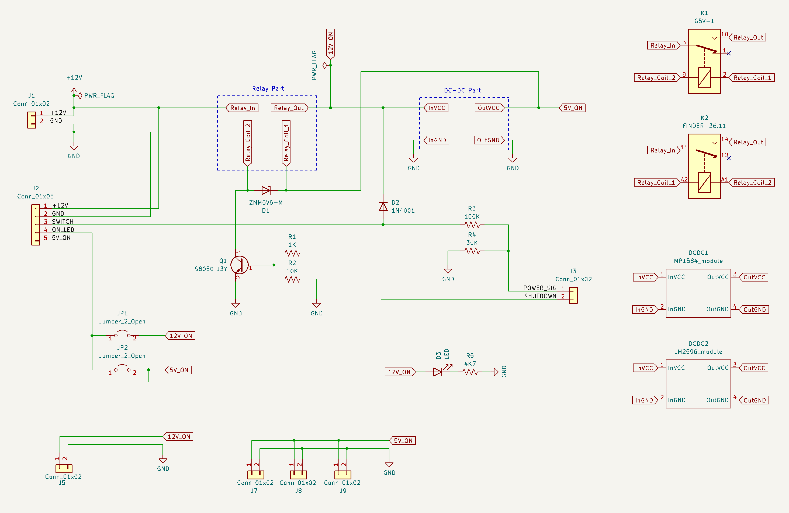
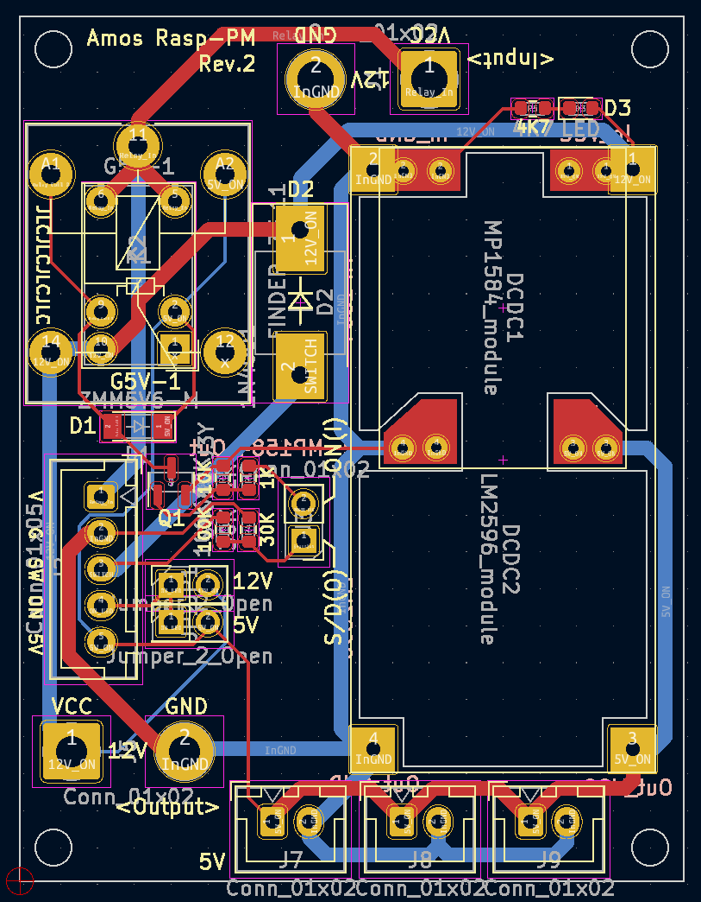
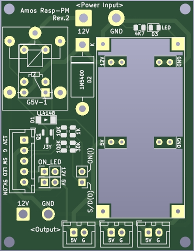
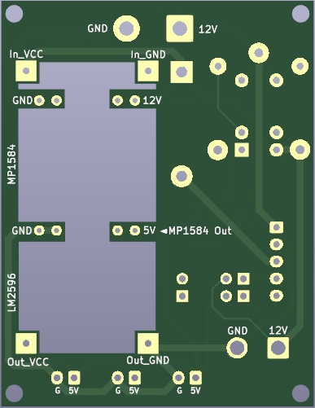

# Raspberry Pie Power Module

Safety-shutdown 기능을 포함한 라즈베리파이의 전원 모듈

---

## 회로도

## PCB

## BOM

| Designator | Package | Quantity | Designation |
|------------|---------|----------|-------------|
| K1 | Relay_SPDT_Omron_G5V-1 | 1 | G5V-1
| K2 | Relay_SPDT_Finder_36.11 | 1 | FINDER-36.11
| R1 | R_0805_2012Metric | 1 | 1K
| R2 | R_0805_2012Metric | 1 | 10K
| R3 | R_0805_2012Metric | 1 | 100K
| R4 | R_0805_2012Metric | 1 | 30K 
| R5 | R_0805_2012Metric | 1 | 4K7
| D1 | D_MiniMELF | 1 | ZMM5V6-M
| D2 | D_SMC-RM10_Universal_Handsoldering | 1 | 1N4001
| D3 | LED_0805_2012Metric | 1 | LED
| Q1 | SOT-23 | 1 | S8050 J3Y
| J2 | JST_XH_B5B-XH-A_1x05_P2.50mm_Vertical | 1 | Conn_01x05
| J3 | PinHeader_1x02_P2.54mm_Vertical | 1 | Conn_01x02
| JP1,JP2 | PinHeader_2x01_P2.54mm_Vertical	| 2 | Jumper_2_Open
| J7,J9,J8 | JST_XH_B2B-XH-A_1x02_P2.50mm_Vertical | 3 | Conn_01x02

## PCB 이미지

### 앞면

### 뒷면

## 샘플 이미지

